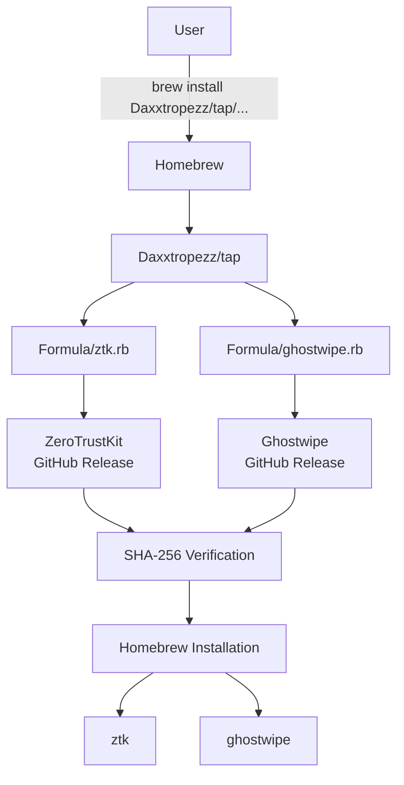
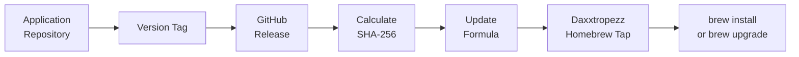
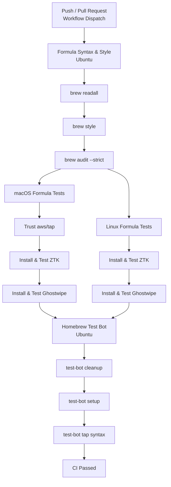

<div align="center">

# Daxxtropezz Homebrew Tap

**Official Homebrew tap for tools maintained by Daxxtropezz**

[](https://brew.sh/)
[](LICENSE)
[](https://github.com/Daxxtropezz)
[](https://github.com/Daxxtropezz/homebrew-tap/actions/workflows/tests.yml)

Homebrew formulae for installing open-source tools maintained by **Daxxtropezz** through the [Homebrew](https://brew.sh/) package manager.

</div>

---

## Installation

You can install a formula directly from this tap:

```bash
brew install Daxxtropezz/tap/<FORMULA>
```

For example:

```bash
brew install Daxxtropezz/tap/ztk
brew install Daxxtropezz/tap/ghostwipe
```

Alternatively, add the tap first:

```bash
brew tap Daxxtropezz/tap
```

### Tap Trust

Homebrew requires trust for non-official taps before their formulae, casks, or commands can be loaded in certain contexts.

For a single formula, prefer trusting only the formula you intend to use:

```bash
brew trust --formula Daxxtropezz/tap/ztk
brew install ztk
```

For Ghostwipe:

```bash
brew trust --formula Daxxtropezz/tap/ghostwipe
brew install ghostwipe
```

If you use this tap regularly and trust all current and future formulae maintained in it, you can trust the entire tap:

```bash
brew tap Daxxtropezz/tap
brew trust Daxxtropezz/tap
```

You can then install formulae using their shorter names:

```bash
brew install ztk
brew install ghostwipe
```

> [!NOTE]
> Installing a fully qualified formula such as `Daxxtropezz/tap/ztk` does not require trusting the entire tap. Whole-tap trust should only be granted if you trust all current and future formulae, casks, and commands published through this repository.

---

## Formulae

| Repository                                                  | Formula                           | Description                                                                                          |
| ----------------------------------------------------------- | --------------------------------- | ---------------------------------------------------------------------------------------------------- |
| [ZeroTrustKit](https://github.com/Daxxtropezz/ZeroTrustKit) | [ztk](Formula/ztk.rb)             | DevSecOps bootstrap platform for cloud, containers, Kubernetes, security, and infrastructure tooling |
| [Ghostwipe](https://github.com/Daxxtropezz/ghostwipe)       | [ghostwipe](Formula/ghostwipe.rb) | Cross-platform system maintenance and cleanup utility for Linux and macOS                            |

---

## How It Works

This tap acts as the package-distribution layer between Homebrew and the upstream Daxxtropezz projects.



When a formula is installed, Homebrew:

1. Locates the formula in this tap.
2. Reads the upstream release URL defined by the formula.
3. Downloads the corresponding versioned release.
4. Verifies the release against its SHA-256 checksum.
5. Installs the required files and dependencies.
6. Links the command into the Homebrew environment.

The application source code remains in its respective upstream repository.

---

## Supported Platforms

| Tool         | macOS Intel | macOS Apple Silicon | Linux AMD64 | Linux ARM64 |
| ------------ | :---------: | :-----------------: | :---------: | :---------: |
| ZeroTrustKit |      ✅      |          ✅          |      ✅      |      ✅      |
| Ghostwipe    |      ✅      |          ✅          |      ✅      |      ✅      |

Platform-specific functionality may vary. See the individual project repositories for detailed compatibility and dependency information.

---

## Usage

### ZeroTrustKit

Install directly:

```bash
brew install Daxxtropezz/tap/ztk
```

Or, if the tap has already been added and trusted:

```bash
brew install ztk
```

Verify:

```bash
ztk --version
ztk --help
```

### Ghostwipe

Install directly:

```bash
brew install Daxxtropezz/tap/ghostwipe
```

Or, if the tap has already been added and trusted:

```bash
brew install ghostwipe
```

Verify:

```bash
ghostwipe --version
ghostwipe --help
```

---

## Updating

Update Homebrew and tap metadata:

```bash
brew update
```

Upgrade ZeroTrustKit:

```bash
brew upgrade ztk
```

Upgrade Ghostwipe:

```bash
brew upgrade ghostwipe
```

Or upgrade all outdated Homebrew packages:

```bash
brew upgrade
```

---

## Uninstallation

Remove ZeroTrustKit:

```bash
brew uninstall ztk
```

Remove Ghostwipe:

```bash
brew uninstall ghostwipe
```

Remove the tap:

```bash
brew untap Daxxtropezz/tap
```

If you previously trusted the entire tap, its trust entry can also be removed:

```bash
brew untrust Daxxtropezz/tap
```

---

## Formula Verification

Each formula references a versioned upstream release and its corresponding SHA-256 checksum.

For example:

```ruby
url "https://github.com/Daxxtropezz/ZeroTrustKit/archive/refs/tags/v1.2.0.tar.gz"
sha256 "<release-sha256>"
```

Homebrew verifies the checksum before installation to ensure that the downloaded source archive matches the release expected by the formula.

The general release flow is:



Existing release tags referenced by published formulae should not be modified or recreated. Fixes should be released under a new version.

---

## Homebrew CI

Formula changes are automatically validated using GitHub Actions.

The workflow runs when:

* Formula files under `Formula/**` are pushed to `main`.
* Formula files are modified in a pull request.
* `.github/workflows/tests.yml` is changed.
* The workflow is manually started with `workflow_dispatch`.

The CI pipeline is structured as follows:



### Formula Syntax & Style

The first job runs on Ubuntu and validates all formula definitions with:

```bash
brew readall Daxxtropezz/tap
brew style Daxxtropezz/tap
brew audit --strict --tap=Daxxtropezz/tap
```

Both platform-specific installation jobs run only after these checks succeed.

### macOS Tests

The macOS job performs real installations and formula tests:

```bash
brew install Daxxtropezz/tap/ztk
brew test Daxxtropezz/tap/ztk
ztk --version
ztk --help
```

and:

```bash
brew install Daxxtropezz/tap/ghostwipe
brew test Daxxtropezz/tap/ghostwipe
ghostwipe --version
ghostwipe --help
```

The workflow also trusts `aws/tap` when required by dependencies used on macOS:

```bash
brew trust aws/tap
```

### Linux Tests

Linux performs the same installation and formula tests and additionally runs:

```bash
ghostwipe doctor
```

This provides an additional runtime validation of the Ghostwipe environment.

### Homebrew Test Bot

After both macOS and Linux tests succeed, the final job runs Homebrew's `test-bot`:

```bash
brew test-bot --only-cleanup-before
brew test-bot --only-setup
brew test-bot --only-tap-syntax
```

The dependency chain is therefore:

```text
Syntax & Style
      │
      ├───────────────┐
      ▼               ▼
 macOS Tests      Linux Tests
      │               │
      └───────┬───────┘
              ▼
      Homebrew Test Bot
```

This prevents platform installation tests from running when the formula definitions already fail syntax, style, or audit checks.

---

## Formula Development

Formulae are located in the [`Formula/`](Formula/) directory:

```text
homebrew-tap/
├── .github/
│   └── workflows/
│       └── tests.yml
├── Formula/
│   ├── ghostwipe.rb
│   └── ztk.rb
├── LICENSE
└── README.md
```

After modifying a formula, validate it locally with Homebrew:

```bash
brew style Daxxtropezz/tap/<FORMULA>
brew audit --strict Daxxtropezz/tap/<FORMULA>
brew test Daxxtropezz/tap/<FORMULA>
```

A clean installation can also be tested with:

```bash
brew uninstall <FORMULA>
brew install Daxxtropezz/tap/<FORMULA>
```

---

## Issues

For issues with the applications themselves, report them in their respective repositories:

| Project      | Issues                                                                         |
| ------------ | ------------------------------------------------------------------------------ |
| ZeroTrustKit | [Daxxtropezz/ZeroTrustKit](https://github.com/Daxxtropezz/ZeroTrustKit/issues) |
| Ghostwipe    | [Daxxtropezz/ghostwipe](https://github.com/Daxxtropezz/ghostwipe/issues)       |

Issues specifically related to Homebrew installation, formula definitions, checksums, CI, or tap behavior can be reported in this repository.

---

## Security

Do not submit credentials, access tokens, API keys, private keys, passwords, or other secrets in issues, pull requests, formulae, or logs.

SHA-256 checksums contained in Homebrew formulae are intentionally public and are used for release integrity verification.

Trusting an entire third-party tap allows Homebrew to load code from all current and future formulae, casks, and commands provided by that tap. Users should only grant whole-tap trust when they trust the repository and its maintainers.

If you discover a security issue in one of the projects, avoid publishing sensitive exploitation details in a public issue.

---

## Documentation

Run:

```bash
brew help
man brew
```

or see the [Homebrew documentation](https://docs.brew.sh/).

---

## License

The formulae and repository content are distributed under the terms of the [MIT License](LICENSE).

Individual projects may define their own licensing terms.

---

<div align="center">

### Daxxtropezz

Open-source tooling for **DevOps · DevSecOps · Cloud · Security · Linux**

[GitHub](https://github.com/Daxxtropezz)

</div>
